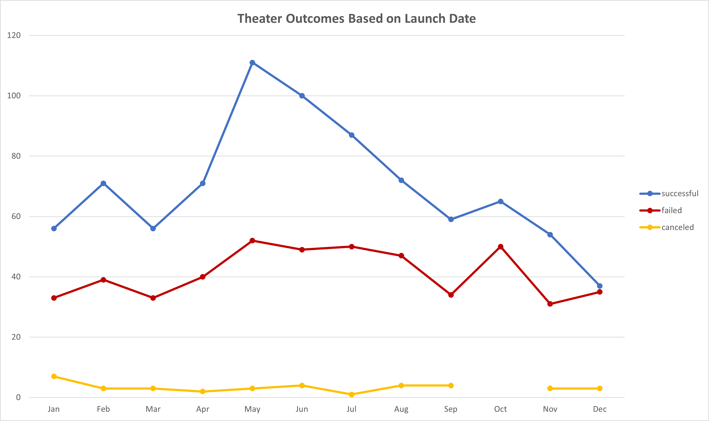
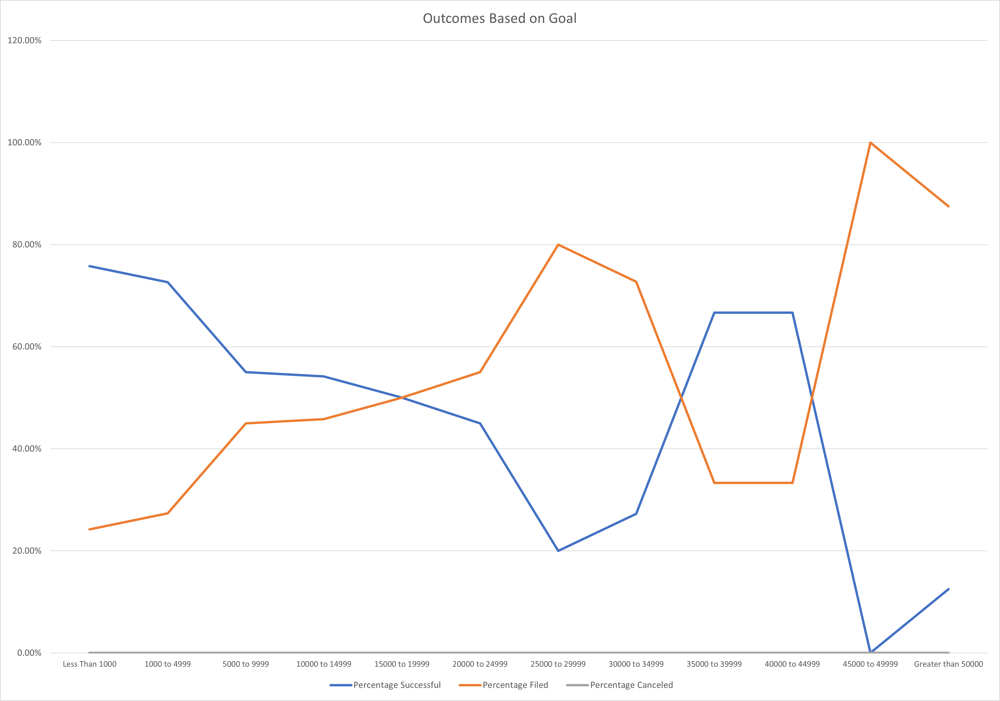

# An Analysis of Theater Kickstarter Campaigns

## Overview of the Project

This project aimed to identify trends that would make a future Theater/Play fundraising campaign the most likely to succeed. By comparing parts of the data with one another I hoped to find results that would allow us to best prepare a client on their campaign. In this case I looked at the launch dates and goals of previous campaigns and compared them to their outcomes (_successful/failed/canceled_). With this data I was able to create graphs and visualize the strategy most likely to help a campaign succeed.

## Analysis and Challenges

### Analysis of Outcomes Based on Launch Date

I took the set of __theater__ campaigns and first converted their Unix launch date to a readable format. Then I created a Pivot Table from the dataset, filtered by Years, and used the months for rows. The columns were populated with the number of _successful/failed/canceled_ campaign values for each month. From this Pivot Table I created a Pivot Chart that visualized the amount of _successful/failed/canceled_ campaigns over the months of the year - please see below:

### Analysis of Outcomes Based on Goals

I filtered the data further by making sure my new dataset would only take into account the campaigns with the subcategory "__plays__" - this would give me a more relevant dataset to work with for my purpose. Keeping with the theme of separating _successful/failed/canceled_ campaigns I then used ranges of monetary values, $0-$50000+, to split the goals further. Then I turned these values into percentages at each range, and graphed the outcome - please see below:

### Challenges and Difficulties Encountered

Although I personally faced little difficulty with creating these graphs, I believe the first challenge would have laid in creating the Pivot Table - deciding which parts of the dataset should be used for Columns/Rows/Values can cause confusion, especially with Pivot Tables being a new concept. The other challenge would be employing the `=COUNTIFS` formula in the Goals table, as this was a new concept that required a more than expected amount of logic.

## Results

### Conclusions from Theater Outcomes by Launch Date

The first conclusion I draw from this graph/dataset is that a client would be best suited to start their theater campaign in May-June during the year, as you see the highest likelihood of success in these months. The second conclusion would certainly be to not start your campaign in December, this is the worst month for success rate, with the failed number of campaigns almost reaching the number of successful ones.

### Conclusions from Outcomes Based on Goals

The main takeaway from this graph/dataset is that a client would be far more likely to see success the lower their goal value is. After the $5000 range there is a sharp drop off of successful campaigns that would lead me to strongly advise against making a goal that high. The 0-$1000 and $1000-$5000 range show about the same amount of success so I would advise a client to aim for around the $3-$4000 mark as there's a high likelihood of success with a meaningful amount of money.

### Limitations of the Dataset

- For theater plays there is little data to draw any meaningful conclusions from past $15000. This is to be expected as the failure rate seems high at this level of funding, but it also means that advising a client on a campaign at this level would be difficult.
- Kickstarter is not the only fundraising website, other sources may cater to Theater and theater fans better and provide more opportunities for successful campaigns.
- Age of data - the data is a fair few years old now, updated data would provide a more realistic view of the chance of success.

### Other Tables/Graphs

Some other ideas for tables and graphs for more visualization could be:
- Outcomes by Duration of Campaign
- Average Donations by Goals
  - Would the higher your goal rely on the average donation going up or the number of backers?
  - Further: Successful Campaigns by Amount of Backers in Goal Ranges
- Success of Theater/Play Campaigns Against Years
  - Are plays less popularly backed over the past few years?
  - Further: Size of Donations/Number of Backers by Month
